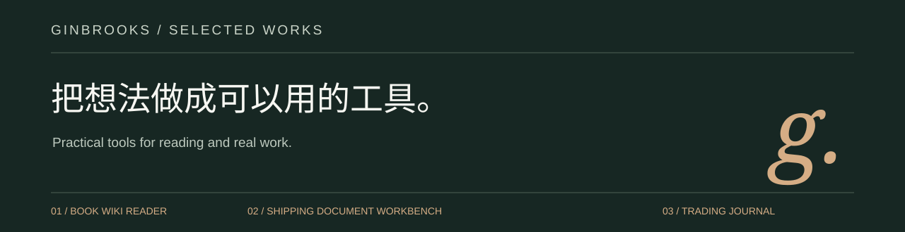

<picture>
  
</picture>

我在做一些从实际问题出发的小产品：把读过的内容留成能查的知识库，把反复核对的资料整理成可靠的流程，也把账户里的交易整理成能看整体、能查细节的工作台。

[**打开作品集 · 直接体验三个项目**](https://ginbrooks.github.io/)

### 01 · Book Wiki Reader

**读完以后，还能找到当时的理解。**

将本地原文、共读笔记与主题线索放在同一个阅读工作台里。支持关键词检索、来源导航与本机阅读进度；配套 Codex Skill 继续讨论书里的问题。

- Python 标准库导入、归档与分块，保留原文和笔记各自的结构。
- 可生成离线网页，无需账号或模型密钥就能浏览、搜索。
- AI 共读由 Codex 执行；独立网页不内置 AI 聊天。

[体验阅读工作台](https://ginbrooks.github.io/demos/book/) · [查看源码与安装方法](https://github.com/ginbrooks/book-wiki-reader-skill)

### 02 · 出运单证工作台

**同一票货，每份文件都要对得上。**

围绕出口单证的资料、复核与文件生成流程，集中处理共用字段、来源确认和业务计算。公开演示可以亲手修改合成资料，检查字段差异并导出预检报告。

- 对比缺项、冲突与待确认来源，保留人工判断。
- Decimal 金额计算，分离客户价与报关价，支持包装与打托方案。
- 本地 Python / Streamlit / SQLite 应用；正式出单需要适配公司模板。

[体验单证预检](https://ginbrooks.github.io/demos/shipping/) · [查看源码与使用边界](https://github.com/ginbrooks/shipping-document-workbench)

### 03 · 交易助手

**接上交易数据，看清整体，也看清每一笔。**

通过平台 API 归集成交与费用，自动整理交易和盈亏。从总体交易曲线看到每笔交易的入场、出场位置，把复盘笔记留在对应记录下。

- **API 数据接入**：当前支持 Binance USD-M 只读同步，点击同步获取和整理历史成交。
- **盈亏总览**：按日查看交易表现与累计已实现净盈亏，手续费和资金费按各自口径展示。
- **入场与出场点**：在 5 分钟 / 1 小时 K 线上查看买卖位置，追溯每条成交。
- **交易下的笔记**：保留当时判断、出场原因和后续复盘。

产品继续面向多平台统一交易分析；跨平台合并盈亏与持续实时同步尚待接通。产品源码私有，公开演示独立实现，全部使用合成数据，不连接账户。

[体验交易助手](https://ginbrooks.github.io/demos/trading/) · [在作品集了解项目](https://ginbrooks.github.io/#trading)

---

结果有出处，计算能复现，重要的判断留给人。
